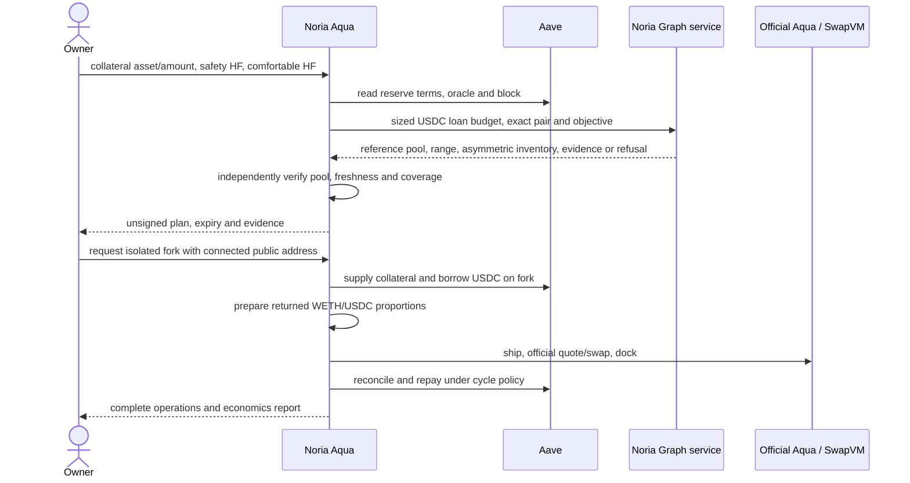

# Noria Aqua product and integration contract

## Product and user

Noria Aqua coordinates a collateral-backed concentrated-liquidity position for an owner who deliberately finances LP inventory with a USDC loan. Supply ETH (wrapped to WETH) **or native USDC as Aave collateral**, choose safety and comfortable health factors, and obtain an automatically selected WETH/USDC position on Arbitrum.

The supplied capital is collateral, not the LP budget. The USDC entry path supplies USDC to Aave and borrows USDC for the LP. Collateral earns Aave supply interest; the loan incurs variable borrowing interest. This does not establish positive carry. A USDC-funded user acquires ETH exposure through the LP inventory. An ETH-funded user has both collateral ETH exposure and the LP's changing exposure.

The user benefits only if the combined LP result and collateral yield justify borrowing, preparation, exit, gas and risk. Fees can coexist with losses. Rising, flat or falling ETH prices alone do not determine profitability. Reports separate LP surplus, owner equity and the consolidated result of related demo wallets.

## Implemented round trip



The source Uniswap pool supplies research. A new Aqua position holds free inventory in `PositionAccount`; Aqua tracks virtual balances. Aave collateral receipts are not shared spendable Aqua inventory. The canonical Uniswap 500-pip router path prepares and realizes inventory, separately from Graph's selected reference and the new Aqua LP.

## Endpoints and units

| Endpoint                                          | Input                                                                      | Output                                                          |
| ------------------------------------------------- | -------------------------------------------------------------------------- | --------------------------------------------------------------- |
| `POST /api/aqua/v1/position`                      | Collateral and two HF limits                                               | Financing quote, full Graph response, execution plan or refusal |
| `POST /api/aqua/v1/recommendation`                | Existing Graph contract: native-USDC inventory budget, objective, interval | Research only; `executionReady: false` remains correct          |
| `GET /api/aqua/v1/local-rehearsal`                | No input, or `runId`                                                       | Runner capability, or job status                                |
| `POST /api/aqua/v1/local-rehearsal`               | `{ "owner": "0x…", "plan": <position response> }`                          | Local job ID; no private key, RPC URL or arbitrary command      |
| `GET /api/aqua/v1/local-rehearsal/report?runId=…` | Finished job ID                                                            | Standalone report, including partial reports after failure      |

Schema: `noria.aqua.position.v1`. Amounts are integer strings: ETH/WETH uses 18 decimals, USDC uses 6, HF uses 18. Require `1 < safety < comfortable <= 10`. Execution prices use **USDC per WETH scaled by 1e6**; Graph's human-unit numbers retain their original form in `graph`.

```json
{
  "schemaVersion": "noria.aqua.position.v1",
  "requestId": "noria-position-usdc-001",
  "intent": {
    "fundingAsset": "USDC",
    "collateralAmountUnits": "2500000000",
    "safetyHFWad": "1400000000000000000",
    "comfortableHFWad": "2000000000000000000",
    "financingMode": "aave_collateral_then_borrow_usdc"
  },
  "reviewAfterHours": 6
}
```

See [USDC example](../../examples/aqua/position-request.usdc.json), [ETH example](../../examples/aqua/position-request.eth.json) and [OpenAPI](../../public/aqua/position-openapi.json).

## Financing and research policy

The loan is sized 50 bps below the tighter of Aave LTV capacity and the comfortable-HF limit, using canonical terms and prices pinned to one block. The resulting **loan**, not collateral value, goes to Graph. Its existing API accepts 1–100,000 USDC. Out-of-bounds loans are refused rather than silently resized. Aave still enforces caps, liquidity and current health during execution.

Graph owns ranking: `highest-ranked-passing-reference-pool`. Aqua preserves its result and exclusions. It independently verifies the pool at the detailed report's indexed block and current head: canonical factory mapping, Arbitrum, exact WETH/native-USDC addresses, fee, nonzero liquidity, block hash, price divergence and current range containment. Current state must be at most 120 seconds old. The actual hourly window must be recent and at least 80% of observations must lie within the proposed range. Single-token/waiting results are refused by this release.

Discovery and the detailed report can have **different indexed blocks**. Both are preserved. `report.position.liquidityRaw` is proposed position liquidity; canonical source-pool liquidity comes from RPC. Graph USD TVL/volume are not relabelled USDC. Query/response hashes use SHA-256; the execution envelope adds `0x` without changing the algorithm.

Expiry is the earliest of five minutes after evaluation, Graph recommendation/report expiry and financing freshness. Graph may impose a much shorter window. Downloaded plans are unsigned research. Parsing verifies internal Graph/envelope consistency; it cannot authenticate provider authorship. Execution independently rechecks the canonical source block, safe financing, current reference and actual prepared inventory. An expired or materially changed plan must be requested again. No checks are relaxed to make the demo pass.

## Asymmetric inventory and the 50/50 distinction

The dated Graph example for a **1,000 USDC inventory budget** returned **0.024445944561000366 WETH and 938.263537 USDC**. Preparation converts **61.736463 USDC**, subject to an actual swap and output bounds. This is not a 50/50 opening allocation. Prepared WETH must be within 1% of the target in the rehearsal. Conversion fees and movement can cause refusal. This example is historical evidence, not a current quote.

The cycle rule is different: after docking, owner provenance confirmation, realization, accrued debt interest and recovery of prior LP losses, 50% of eligible LP surplus amortizes debt and 50% increases next-cycle capital. This release rejects nonzero cost provisions: **eligible LP surplus is before wallet-paid gas**, which is included separately in full-wallet reports. Donations, borrowing and outside debt repayments are not LP revenue. Related-party payments cancel in consolidated group P&L.

At/below safety health, ordinary investment and allocation stop; defense prioritizes repayment. Below comfortable health, new cycles cannot ship. Debt-free accounts cannot silently reopen or reborrow. See [architecture](architecture.md) for ownership, reconciliation and lifecycle details.

## Privy and local simulation

Set the public `NEXT_PUBLIC_PRIVY_APP_ID` before building and allow local/deployed origins in Privy. The UI uses external-wallet connection, Arbitrum support, account display, network switching and disconnect. Embedded wallet creation is disabled. Connecting requests no signature and authorizes no public-chain transaction.

Without an App ID, the UI displays wallet connection as unavailable; research and plan downloads work. This state does not demonstrate a successfully tested real Privy connection. A real App ID and configured origins are needed for that acceptance check.

Install Foundry (`forge`/`anvil` on `PATH`) on macOS/Linux, set `NORIA_ENABLE_LOCAL_FORK=1` and bind the app to loopback. Vercel, native Windows and non-loopback hosts are refused. The UI requires a connected public address and unexpired plan. An owned local Anvil impersonates that address, gives it labeled fixture balances, executes official contracts and writes a report. No mutation is sent upstream. One job runs at a time; a four-minute deadline stops its private process group, with forced shutdown after ten more seconds if necessary. An interrupted server may leave `.runtime/aqua-rehearsals/active.lock`; remove it only after confirming its process has stopped.

```sh
npm ci
NORIA_ENABLE_LOCAL_FORK=1 npm run dev
```

Download the full plan in `/aqua`, then alternatively run from `integrations/aqua`:

```sh
NORIA_PLAN_FILE=/absolute/path/to/downloaded-plan.json \
NORIA_OWNER=0x00000000000000000000000000000000000a11ce \
npm run fork:rehearse
```

Use root `npm ci` for the integrated app. Standalone contributors can install with the module's pinned pnpm lock in a separate checkout. Avoid mixing npm and pnpm installations in the same dependency tree.

## Review map and boundaries

- `src/integrations/aqua/position-{contract,service,http}.ts`: intent, real Graph adapter and HTTP boundary.
- `src/integrations/aqua/local-rehearsal.ts`: opt-in loopback job runner and bounded body handling.
- `src/components/AquaWorkbench.tsx`, `NoriaWallet*.tsx`: inputs, review, Privy and reports.
- `integrations/aqua/src/rehearsal-plan.ts`: downloaded-plan validation; no executable calldata.
- `integrations/aqua/scripts/rehearse.ts`: official fork execution and artifacts.
- `tests/unit/aqua-position.test.ts`, `tests/browser/aqua.spec.ts`: integration and UI regressions.

The older standalone `noria.aqua.discovery.v1` candidate planner and synthetic examples remain isolated tests. They are not the production Graph format/ranking, documented in [the Graph team's handoff](../aqua-integration.md).

Shipment does not register the strategy with the 1inch aggregator. The demonstrated route uses eligible taker quotes/swaps through official SwapVM; the fork provides a labeled access-credential fixture. `routingStatus: not_validated` and `economics: not-established` remain explicit. Public deployment, independent demand and commercial routing admission are separate work.
