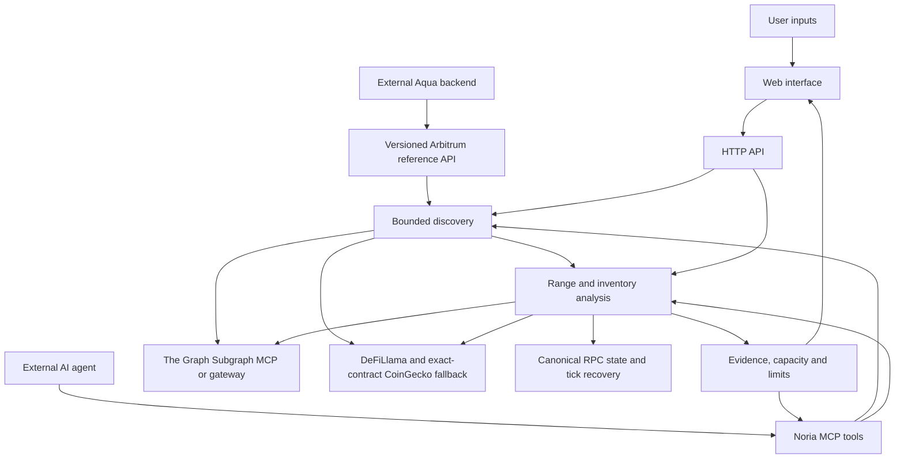

# Architecture

Noria is an informational Uniswap v3 discovery and analysis application. The web interface and HTTP and local MCP servers share the same services. An external AI client supplies the language model; Noria contains no built-in LLM, wallet or execution loop.

## Source map

| Path                                            | Responsibility                                                                                      |
| ----------------------------------------------- | --------------------------------------------------------------------------------------------------- |
| `src/app`                                       | Next.js pages, layout and HTTP routes                                                               |
| `src/app/api/noria/route.ts`                    | Networks, search, discovery, explicit analysis and historical data                                  |
| `src/integrations/aqua`                         | Exact Arbitrum WETH/native-USDC contract, selection adapter and HTTP boundary                       |
| `src/components/AquaWorkbench.tsx`              | Focused preview at `/aqua`, input cancellation, source expiry and handoff inspection                |
| `src/components/NoriaApp.tsx`                   | Workspace composition from focused controls, candidates, charts and evidence components             |
| `src/components/useNoriaWorkspace.ts`           | Requests, cancellation, selection and report lifecycle state                                        |
| `src/config/networks.ts`                        | Chain, subgraph, factory, RPC and explorer configuration                                            |
| `src/providers/graph.ts`                        | Graph MCP/gateway queries, request budgets and transient retries                                    |
| `src/providers/prices.ts`                       | USD references with exact-contract fallback and original timestamps                                 |
| `src/providers/snapshot.ts`                     | Pinned Graph/RPC collection, canonical identity checks and tick recovery                            |
| `src/services/discovery.ts`                     | Token universe, pool screening, ranking and up to four analysis attempts                            |
| `src/services/analysis.ts`                      | Input validation, snapshot reuse, report orchestration and historical loading                       |
| `src/domain/types.ts`                           | Shared input, evidence and report contracts                                                         |
| `src/domain/analysis-data.ts`                   | Strict schemas, snapshot shape, fee spacing and digest helpers                                      |
| `src/domain/report.ts`                          | Pure range construction, inventory, capacity, costs and report generation                           |
| `src/domain/uniswap.ts`                         | Public Uniswap SDK adapter and integer inventory sizing                                             |
| `src/domain/ticks.ts`                           | Full-distribution validation, bitmap recovery and range liquidity                                   |
| `src/domain/price-mark.ts`                      | Pure price-reference validation and age policy                                                      |
| `src/domain/price-references.ts`                | Token/native quote assembly and relative-price consistency                                          |
| `src/mcp/`                                      | Shared tool validation/execution, official SDK protocol, stateless HTTP and local stdio entry point |
| `scripts/call-tool.ts`                          | MCP command-line transport client                                                                   |
| `tests/unit`, `tests/browser`, `tests/fixtures` | Offline behavior, browser flows and curated inputs                                                  |
| `data/examples`                                 | Dated historical example and accounting ledger                                                      |

## Discovery

Discovery validates token contracts against Uniswap's compiled public token list for the selected chain. It searches a named token universe or an explicit query. A pair query constrains both legs before the Graph cutoff; an unknown token query does not silently broaden the search. Token-list membership is an address filter, not a token-risk assessment.

The Graph returns at most **40 pools**, initially ordered by indexed TVL. Candidates need positive liquidity, a supported fee tier, at least seven days of pool age, **$250,000** independently marked TVL, **$50,000** approximate daily volume and swap activity in **18 of 24** completed hours. Each token balance and volume leg must be finite and nonnegative.

TVL uses each token balance times its USD mark. Volume uses half the sum of both marked token legs to avoid double-counting a swap. Ranking combines recurring activity, volume, TVL and turnover through an explicit heuristic; it has no established predictive relationship to fees or returns. The initial 40-pool cutoff can exclude a pool that would rank better after revaluation.

The service attempts full analysis of the first **four** ranked candidates sequentially. The first result with verified data and feasible capacity becomes the suggestion. `report: null` is a valid result, with attempted candidates and exclusion reasons preserved. Search and analysis snapshots can have different source times.

## Snapshot and price verification

Full analysis pins Graph reads to a canonical block six blocks behind its watermark. It requires **168 consecutive completed hourly observations**. RPC checks the chain, block hash/time, factory, canonical pool address, token addresses and decimals, fee, spacing, price, tick, active liquidity and unlocked state.

Initialized Graph ticks are paginated in 1,000-row pages with a 5,000-tick budget. Full-distribution invariants include ordered, unique, aligned ticks; valid type bounds; compatible gross/net liquidity; and reconciliation with canonical active liquidity. If indexed ticks are inconsistent or their complete distribution exceeds the budget, the service can recover every bitmap word and initialized tick in the bounded window covering spot and supported ranges. It anchors this window to canonical liquidity and rechecks the block hash. Recovery does not audit ticks outside that window or replace missing hourly history.

DeFiLlama supplies USD marks for both token contracts and the native gas asset separately. Only missing or expired primary marks may use CoinGecko fallback; malformed or explicitly low-confidence primary values are refused. Token fallbacks use exact chain/contract identity, never symbols or an assumed stablecoin peg. CoinGecko supplies no comparable confidence score, so the report preserves `null`.

Marks must be positive and valid at their original timestamp. They are recent through **300 seconds**, eligible with an age caveat through **900 seconds**, and rejected after that. The token USD ratio must agree with the canonical relative pool price within the **2%** policy. This check cannot detect a shared USD valuation error.

## Ranges, inventory and capacity

Fee exposure uses the prior seven days' 10th–90th percentile ticks, rounded outward to the pool's tick spacing. This can produce one-sided inventory and a range outside spot. Swap fees accrue only while the price is in range.

Planned conversion uses token1 to acquire token0 below spot. For discount `d`, its starting boundaries are approximately `spot × (1 − 1.5d)` and `spot × (1 − d)`, aligned downward. A minimum-width adjustment extends the lower boundary. The complete-conversion amount is a boundary calculation, not a predicted fill; conversion can reverse before withdrawal.

The Uniswap SDK sizes integer liquidity to fit the USD-marked inventory budget, reporting residual marked value separately. Supported fee tiers are 0.01%, 0.05%, 0.3% and 1%. Regular analysis assumes the required composition is held. The Aqua reference adapter values a raw native-USDC budget at the same snapshot's USD quote and flags inventory preparation when WETH is required; it does not quote or perform that swap. Public discovery/MCP presets remain strict, while internal report construction accepts the independently valued integration budget. The 6/24-hour input changes the review guidance, not range math.

Capacity measures the proposed position's share of total liquidity in every segment of its range. The policy permits at most **1%** in every segment. This is a present-state research constraint; passing it does not establish economic merit or protect against future liquidity changes. Reports always retain `checks.economics: "not-established"`.

## Freshness, costs and report integrity

The source block has a **120-second** age limit. Report expiry is the earliest of block time + 120 seconds, oldest mark time + 900 seconds, or analysis time + 60 seconds. Short-lived snapshot reuse does not renew timestamps. A refresh failure preserves an older report's date instead of making it appear current.

Gas uses an observed native gas price, a separate native-token USD mark and fixed illustrative lifecycle units. It is outside the modeled inventory budget. Preparation/exit swaps and L2 data fees are unpriced; USD marks are not executable proceeds.

Reports contain source identifiers, block/hash/time, query/response digests, inventory and checks. `noria_verify_report` checks an existing same-session report's internal hash, budget conservation and expiry. It neither refreshes providers nor signs provenance, independently replays capacity or verifies a transaction. The report ID covers the report, not the surrounding discovery candidates and exclusions. Downloads omit raw ticks; a compact CLI presentation can also omit history points.

The dated historical example is loaded separately and never feeds live collection. Its supplied ledger supports arithmetic inspection, not independent replay of the complete historical market.

## Execution boundary

The [Aqua reference API](aqua-integration.md) is implemented and shares the Graph-first pipeline. It accepts only native USDC funding on Arbitrum and exact WETH/native-USDC reference pools. It returns an informational handoff, never a signing payload. The full web application retains its four networks.

All Aave borrowing, actual Aqua liquidity, surplus allocation and debt management are [planned](roadmap.md). The execution product must translate the economic range and target inventory into Aqua-specific strategy and execution semantics; a Uniswap pool address, tick interval or liquidity integer cannot be submitted directly to Aqua.

## Hosted agent access

`/api/mcp` uses a new official SDK server and Web-standard Streamable HTTP transport for every request, returning JSON before closing the server. `/agent` derives its connection URL from the current browser origin. HTTP verification receives the complete report; only stdio retains a bounded session cache for ID lookup. Verification checks unkeyed hash consistency, budget conservation and expiry, not issuer authenticity. Explicit Next.js output tracing includes runtime documents and historical data, and CI checks those manifests after the production build.
